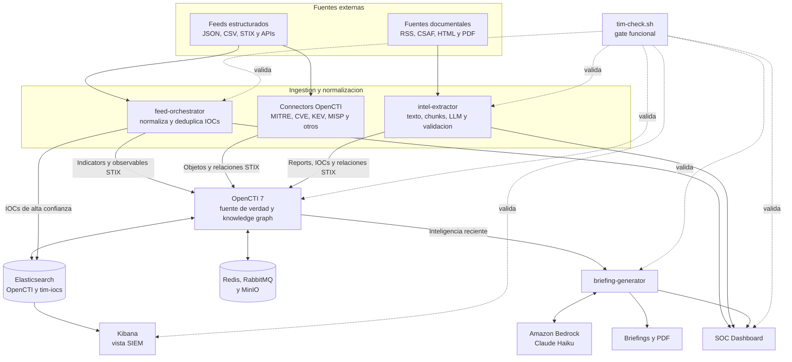

# Guia de incorporacion a TIM

Esta guia presenta la arquitectura y el recorrido recomendado para trabajar en TIM. Se genero a partir del knowledge graph de `opencti-7-pilot`, analizado en el commit `383d0488edcae3ae74c304b573b0942539506885`.

## Descripcion general

TIM es una plataforma de threat intelligence basada en OpenCTI 7. Ingiere feeds estructurados y documentos, normaliza IOCs, genera relaciones STIX y produce briefings ejecutivos. La generacion corre en Amazon Bedrock.

Las tecnologias principales son Python, FastAPI, JavaScript, React, Shell, Docker Compose, OpenCTI, Redis, Elasticsearch, RabbitMQ y Amazon Bedrock.

## Modelo mental

El flujo principal de datos es:

1. Los feeds estructurados entran por `feed-orchestrator` o por connectors de OpenCTI.
2. Los documentos RSS, CSAF, HTML o PDF entran por `intel-extractor`.
3. Ambos canales normalizan sus resultados como objetos y relaciones STIX en OpenCTI.
4. `briefing-generator` consulta OpenCTI y genera reportes ejecutivos mediante un LLM.
5. El SOC Dashboard presenta ingestion, briefings y estado operativo.
6. `tim-check.sh` valida que los servicios no solo esten levantados, sino que sus contratos y flujos funcionen.

OpenCTI es la fuente de verdad y el knowledge graph. Los demas servicios leen de el, escriben en el o presentan sus datos.

### Diagrama del modelo mental



Las flechas continuas representan flujo de datos o consultas. Las flechas discontinuas representan verificaciones de readiness y contratos funcionales. OpenCTI conserva entidades y relaciones, y SQLite conserva el estado de los briefings y del pipeline documental.

## Capas arquitectonicas

| Capa | Responsabilidad | Archivos clave |
|---|---|---|
| Ingesta de inteligencia | Recolectar feeds y documentos, normalizar IOCs y persistir inteligencia STIX | `services/feed-orchestrator/main.py`, `services/intel-extractor/collector.py`, `services/intel-extractor/extractor.py` |
| Generacion de briefings | Consultar OpenCTI, generar resumenes, persistirlos y renderizar PDF | `services/briefing-generator/generator.py`, `services/briefing-generator/store.py` |
| Interfaz operativa | Proporcionar el SOC Dashboard React y el acceso unificado a las APIs | `services/dashboard/src/App.jsx`, `services/dashboard/src/api.js` |
| Automatizacion operativa | Arrancar, verificar, respaldar y diagnosticar la plataforma | `scripts/bootstrap-platform.sh`, `scripts/tim-check.sh`, `scripts/verify-service-contracts.py` |
| Pruebas y evaluacion | Verificar feeds, extraccion, briefings y contratos operativos | `services/*/tests/`, `scripts/test-*` |
| Infraestructura Docker | Definir perfiles, dependencias, healthchecks, memoria y redes | `docker-compose.yml`, `services/*/Dockerfile` |
| Configuracion | Centralizar entorno, manifests, fuentes y corpus esperado | `.env.example`, `services/intel-extractor/sources.yaml` |
| Documentacion y corpus | Mantener manuales, auditorias y datasets de evaluacion | `README.md`, `SECURITY-AUDIT-2026-07-02.md` |

## Conceptos clave

### Dos canales de ingestion

Los feeds estructurados pasan por descarga, normalizacion, deduplicacion Redis, escritura OpenCTI e indexacion Elasticsearch. El contrato comun se encuentra en `services/feed-orchestrator/feeds/base.py`.

Los documentos siguen el flujo descubrimiento, descarga controlada, extraccion de texto, chunking, consulta LLM, normalizacion, validacion y escritura STIX. Sus piezas principales estan en `collector.py`, `parser.py`, `extractor.py` y `sources.yaml`.

### Escritura controlada en OpenCTI

Las ingestas sensibles, como CNSD, usan provenance, IDs deterministas, preview sin escritura, trust gates y readback posterior. El objetivo es impedir que candidatos no verificados se conviertan automaticamente en falsos IOCs.

### Proveedor de generacion

`intel-extractor` y `briefing-generator` generan con Claude Haiku via Amazon Bedrock, autenticados por el rol IAM de la instancia; no hay claves en disco ni modelo local. El extractor envia el documento completo en una sola llamada. El piloto local con Ollama se retiro el 2026-09-19.

### Readiness funcional

Un contenedor `healthy` no garantiza que la plataforma funcione. Los verificadores prueban contratos JSON, autenticacion, datos OpenCTI y flujos reales del SOC Dashboard y Kibana.

## Recorrido guiado

1. **Panorama de TIM:** leer el `README.md` de la raiz para comprender capacidades, servicios y operacion.
2. **Orquestacion y arranque:** revisar `docker-compose.yml`, `.env.example` y `scripts/bootstrap-platform.sh` en la raiz.
3. **Ingesta programada:** seguir `services/feed-orchestrator/main.py`, `config.py`, `scheduler.py` y `opencti_client.py`.
4. **Contrato de feeds:** estudiar `feeds/base.py`, `deduplicator.py` y `api.py`.
5. **Connectors de OpenCTI:** revisar `services/connector-cve/` y `services/connector-greynoise-feed/`.
6. **Extraccion documental:** seguir `intel-extractor/main.py`, `collector.py`, `parser.py`, `extractor.py` y `sources.yaml`.
7. **Briefings ejecutivos:** revisar `briefing-generator/main.py`, `generator.py`, `store.py` y `pdf_renderer.py`.
8. **Experiencia del analista:** seguir `dashboard/src/main.jsx`, `App.jsx` y `api.js`.
9. **Empaquetado:** revisar `docker-compose.yml` y los Dockerfiles de cada servicio.
10. **Verificacion integral:** cerrar con `tim-check.sh`, `verify-platform.sh`, `verify-service-contracts.py` y `verify-uis.mjs`.

## Mapa de archivos

| Archivo | Responsabilidad |
|---|---|
| `services/feed-orchestrator/main.py` | Registra feeds, scheduler y API |
| `services/feed-orchestrator/feeds/base.py` | Define el contrato comun de ingestion |
| `services/feed-orchestrator/api.py` | Expone estado, alertas, IOCs y exportacion STIX |
| `services/intel-extractor/collector.py` | Descubre documentos periodicamente |
| `services/intel-extractor/parser.py` | Descarga y convierte documentos en texto |
| `services/intel-extractor/extractor.py` | Extrae, normaliza y persiste IOCs |
| `services/intel-extractor/cnsd_ingest.py` | Ejecuta la ingestion controlada de CNSD |
| `services/intel-extractor/opencti_client.py` | Crea objetos y relaciones STIX idempotentes |
| `services/briefing-generator/generator.py` | Construye briefings fundamentados en OpenCTI |
| `services/dashboard/src/api.js` | Centraliza los contratos HTTP del frontend |
| `scripts/verify-service-contracts.py` | Valida contratos del despliegue completo |
| `docker-compose.yml` | Define la topologia completa de servicios |

## Zonas de mayor complejidad

### `services/intel-extractor/collector.py`

Combina polling, varios formatos de fuente, protecciones de transporte, deduplicacion y estado durable. Los cambios deben cubrir feeds RSS, CSAF y colecciones HTML.

### `services/intel-extractor/cnsd_ingest.py`

Implementa trust gates, IDs deterministas, escritura OpenCTI y verificacion posterior. Cualquier relajacion puede introducir entidades o relaciones no fundamentadas.

### `services/intel-extractor/extractor.py`

Concentra chunking, llamadas LLM, grounding, refang, normalizacion, deduplicacion y generacion STIX. Debe evaluarse tanto precision como recall.

### `services/feed-orchestrator/feeds/base.py`

Es el contrato compartido por todos los feeds. Un cambio afecta descarga, retries, deduplicacion, OpenCTI, Elasticsearch, Redis y metricas.

### `scripts/verify-service-contracts.py`

Es un gate transversal. Sus fallos deben reportar el contrato y servicio exactos sin convertir condiciones transitorias en falsos positivos permanentes.

## Operacion inicial

Arrancar y verificar la plataforma:

```bash
./scripts/bootstrap-platform.sh aws
./scripts/tim-check.sh aws
```

Detener completamente los perfiles y recursos del despliegue:

```bash
docker compose --profile '*' down
```

Durante el desarrollo, las pruebas unitarias deben ejecutarse antes de los gates funcionales. Los cambios que afecten integraciones compartidas tambien deben verificarse contra la plataforma desplegada.

## Primeras tareas recomendadas

1. Arrancar la plataforma y observar cada fase de `bootstrap-platform.sh`.
2. Ejecutar `tim-check.sh` y relacionar cada gate con el servicio que valida.
3. Seguir un IOC desde un feed hasta OpenCTI y Elasticsearch.
4. Seguir un documento desde `collector.py` hasta su Report y relaciones en OpenCTI.
5. Revisar una prueba de `collector.py`, `extractor.py` y `cnsd_ingest.py` antes de modificar esos modulos.
