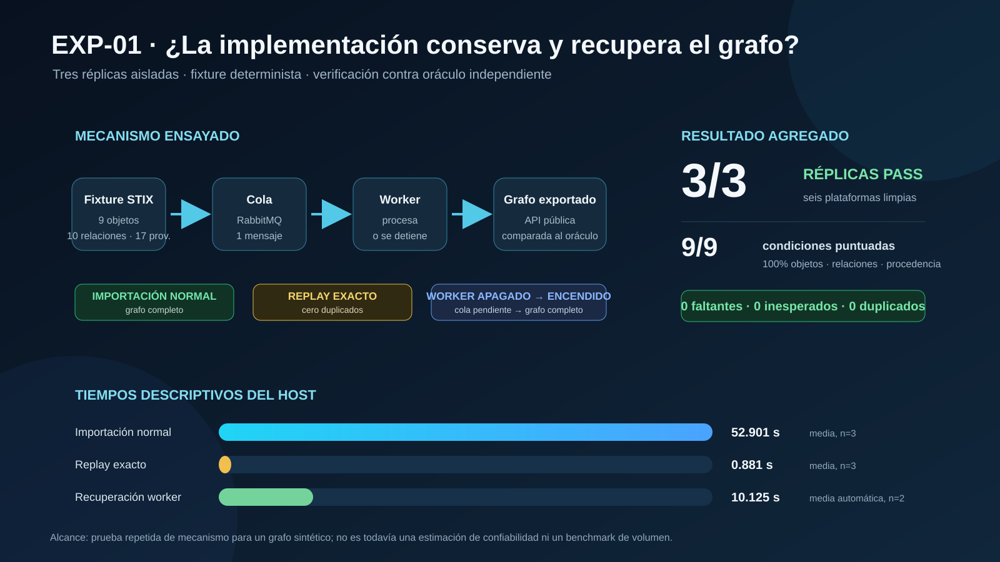
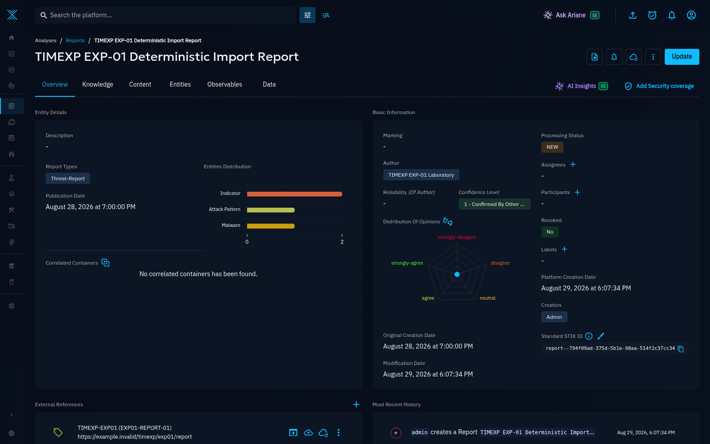

# EXP-01 — Importación determinista, replay y recuperación de cola

Fecha de ejecución: 2026-08-29. Resultado global: **PASS (3/3 réplicas)**.

## Relato simple del experimento

Se levantó una plataforma OpenCTI vacía y se le entregó un grafo STIX cuyo contenido era conocido de antemano: 9 objetos, 10 hechos relacionales y 17 hechos de procedencia. Después se preguntó a la plataforma, mediante su API pública, qué había quedado realmente almacenado y se comparó esa respuesta con un oráculo independiente.

La prueba se repitió en tres ambientes aislados. En cada réplica se verificaron tres comportamientos: una importación normal, el reenvío exacto del mismo contenido y una importación enviada mientras el worker estaba apagado. En la tercera condición se comprobó primero que el mensaje permanecía en la cola y que el grafo seguía vacío; luego se encendió únicamente el worker y se verificó que el trabajo terminara y el grafo quedara completo.

## Diseño y criterio de aceptación

El fixture contiene una identidad, dos indicadores, un malware, una técnica, tres relaciones explícitas y un reporte. El reporte incorpora siete objetos; por eso el oráculo evalúa 10 hechos relacionales en total. También exige ocho enlaces `created_by_ref` y nueve referencias externas, es decir, 17 hechos de procedencia.

Una condición sólo aprueba si la exportación recupera 9/9 objetos, 10/10 hechos relacionales y 17/17 hechos de procedencia, sin objetos faltantes, inesperados ni duplicados. El estado `complete` del trabajo no se acepta por sí solo como evidencia de integridad.

## Resultados por réplica

| Réplica | Importación normal | Replay exacto | Recuperación del worker | Resultado |
|---:|---:|---:|---:|---:|
| 1 | 54.939 s | 0.907 s | 63.994 s, con pausa manual | PASS |
| 2 | 51.909 s | 0.896 s | 10.119 s, automatizada | PASS |
| 3 | 51.854 s | 0.840 s | 10.130 s, automatizada | PASS |

Las tres réplicas comenzaron con líneas base vacías. Las nueve condiciones puntuadas —normal, replay y recuperación en cada réplica— obtuvieron recuperación perfecta y cero duplicados. En las tres interrupciones se observó la misma transición:

| Momento | Trabajo | Mensajes listos | Consumidores | Objetos observados |
|---|---:|---:|---:|---:|
| Worker apagado | `progress` | 1 | 0 | 0/9 |
| Worker reiniciado | `complete` | 0 | 1 | 9/9 |

## Resumen cuantitativo

| Medida | n | Media | Mediana | Mínimo | Máximo |
|---|---:|---:|---:|---:|---:|
| Importación normal | 3 | 52.901 s | 51.909 s | 51.854 s | 54.939 s |
| Replay exacto | 3 | 0.881 s | 0.896 s | 0.840 s | 0.907 s |
| Recuperación automatizada | 2 | 10.125 s | 10.125 s | 10.119 s | 10.130 s |

El tiempo de recuperación de la réplica 1 se informa, pero se excluye del promedio automatizado porque incluye una pausa manual deliberada. Los tiempos son descriptivos de este host y este fixture; no constituyen todavía un benchmark de rendimiento.

## Evidencia visual de la plataforma

La captura siguiente fue obtenida de la réplica 3 después de la recuperación. Muestra el reporte importado, su autor, su referencia externa y la distribución de las entidades relacionadas. Sirve para inspección humana; las conclusiones cuantitativas proceden de la API y del oráculo, no de la captura.

## Hallazgo metodológico durante la réplica 3

La primera lectura de cola tomada 2.6 segundos después de que el trabajo reportara `complete` todavía mostró `1 mensaje / 0 consumidores`. La importación y el puntaje ya eran correctos. Se comprobó que RabbitMQ estaba configurado con `collect_statistics_interval = 5000` ms y que la misma API convergía después a `0 mensajes / 1 consumidor`.

La muestra prematura se conserva como `queue-after-restart-immediate.json`. El arnés fue corregido para esperar, con un límite de 30 segundos, hasta que la condición de cola drenada sea observable. Esto no cambia el criterio de éxito; evita confundir el retraso de las métricas de administración con un mensaje no procesado.

## Conclusiones

1. **La importación preservó el grafo ensayado.** Las tres exportaciones independientes recuperaron todos los objetos, relaciones y hechos de procedencia exigidos por el oráculo.
2. **El replay exacto fue idempotente.** En las tres réplicas se conservaron los identificadores canónicos y no aparecieron duplicados lógicos ni cambios en el grafo esperado.
3. **La cola desacopló recepción y procesamiento.** Con el worker detenido, el mensaje permaneció pendiente y el grafo no se modificó. Al reiniciar únicamente el worker, las tres réplicas terminaron sin errores y convergieron al mismo grafo de la importación normal.
4. **La evaluación debe usar identidad lógica estable.** OpenCTI canonicaliza los IDs STIX; por eso el evaluador identifica objetos mediante referencias externas `TIMEXP-EXP01` y luego compara las relaciones entre los IDs canónicos observados.
5. **Los contadores operativos no sustituyen la verificación semántica.** `import_processed_number` varió aunque los grafos finales fueran equivalentes; la conclusión se apoya en la exportación completa y el oráculo.

## Qué demuestra y qué no demuestra

EXP-01 aporta una prueba repetida de mecanismo: para este grafo sintético determinista, la implementación importa correctamente, tolera un replay exacto y recupera trabajo pendiente después de detener el worker.

No estima una tasa de fallos en producción ni evalúa volumen alto, caída de RabbitMQ o del host, recuperación de almacenamiento, extracción desde documentos reales o utilidad para un analista. Esas afirmaciones requieren experimentos posteriores.

## Reproducción e inspección

El procedimiento completo está en `PROTOCOL.md`; el ambiente fijado está en `ENVIRONMENT.json`; la consolidación está en `AGGREGATE.json`; y los resultados individuales están en `summaries/`. Los snapshots, estados de trabajo, colas y puntajes están en `runs/`. `runs/calibration/` y `runs/trial-u/` quedan excluidos de las conclusiones oficiales.

La réplica final permanece disponible en `http://127.0.0.1:18080` con `admin@timexp.local` / `TimExp-Only-2026!`. `MANIFEST.json` fija el tamaño y SHA-256 de cada artefacto del paquete.
